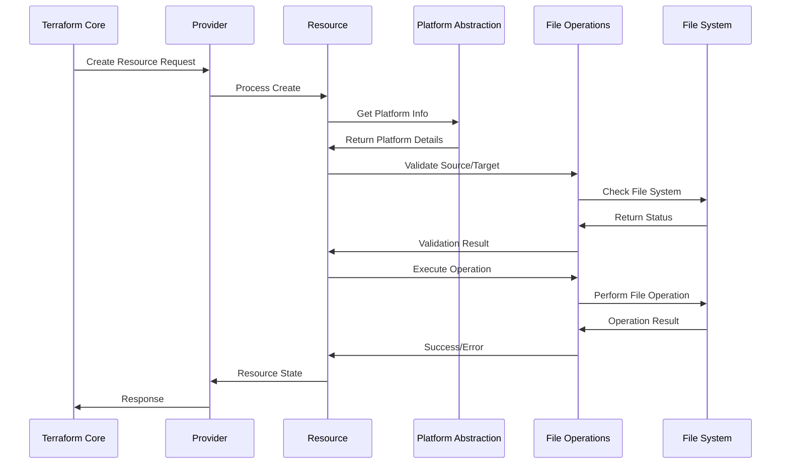
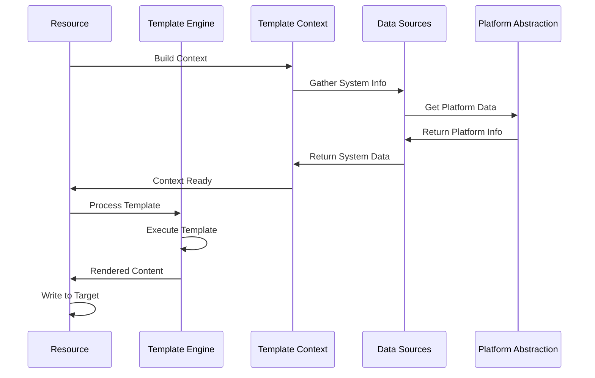

# Terraform Dotfiles Provider Architecture

## Project Structure

```
terraform-provider-dotfiles/
├── .github/
│   ├── workflows/
│   │   ├── test.yml              # CI/CD pipeline
│   │   ├── release.yml           # Release automation
│   │   └── security.yml          # Security scanning
│   └── ISSUE_TEMPLATE/           # Issue templates
├── docs/                         # Generated documentation
│   ├── index.md                  # Provider documentation
│   ├── resources/                # Resource documentation
│   │   ├── repository.md
│   │   ├── file.md
│   │   ├── symlink.md
│   │   ├── directory.md
│   │   ├── application.md
│   │   └── template.md
│   └── data-sources/             # Data source documentation
│       ├── system.md
│       ├── file_info.md
│       └── application_info.md
├── examples/                     # Usage examples
│   ├── basic-setup/
│   │   ├── main.tf
│   │   └── variables.tf
│   ├── complete-environment/
│   │   ├── main.tf
│   │   ├── variables.tf
│   │   └── terraform.tfvars.example
│   ├── team-dotfiles/
│   └── ci-cd-integration/
├── internal/                     # Provider implementation
│   ├── provider/                 # Main provider logic
│   │   ├── provider.go           # Provider definition
│   │   ├── config.go             # Provider configuration
│   │   ├── client.go             # Provider client/context
│   │   ├── repository_resource.go # Repository resource
│   │   ├── file_resource.go      # File resource
│   │   ├── symlink_resource.go   # Symlink resource
│   │   ├── directory_resource.go # Directory resource
│   │   ├── application_resource.go # Application resource
│   │   ├── template_resource.go  # Template resource
│   │   ├── system_data_source.go # System data source
│   │   ├── file_info_data_source.go # File info data source
│   │   ├── application_info_data_source.go # App info data source
│   │   └── *_test.go             # Test files
│   ├── platform/                 # Platform abstraction
│   │   ├── platform.go           # Platform interface
│   │   ├── detector.go           # Platform detection
│   │   ├── path_resolver.go      # Path resolution
│   │   ├── darwin.go             # macOS implementation
│   │   ├── linux.go              # Linux implementation
│   │   ├── windows.go            # Windows implementation
│   │   └── *_test.go             # Platform tests
│   ├── fileops/                  # File operations
│   │   ├── operations.go         # Core file operations
│   │   ├── backup.go             # Backup system
│   │   ├── validation.go         # File validation
│   │   ├── permissions.go        # Permission management
│   │   ├── conflict.go           # Conflict resolution
│   │   └── *_test.go             # File operation tests
│   ├── template/                 # Template processing
│   │   ├── engine.go             # Template engine interface
│   │   ├── go_template.go        # Go template implementation
│   │   ├── context.go            # Template context
│   │   ├── functions.go          # Custom template functions
│   │   ├── validation.go         # Template validation
│   │   └── *_test.go             # Template tests
│   ├── models/                   # Data models
│   │   ├── repository.go         # Repository model
│   │   ├── file.go               # File model
│   │   ├── symlink.go            # Symlink model
│   │   ├── directory.go          # Directory model
│   │   ├── application.go        # Application model
│   │   ├── template.go           # Template model
│   │   ├── system.go             # System info model
│   │   └── common.go             # Common model utilities
│   ├── security/                 # Security features
│   │   ├── sensitive.go          # Sensitive data handling
│   │   ├── encryption.go         # Encryption utilities
│   │   ├── validation.go         # Security validation
│   │   ├── audit.go              # Audit logging
│   │   └── *_test.go             # Security tests
│   ├── state/                    # State management
│   │   ├── manager.go            # State manager
│   │   ├── tracker.go            # File tracking
│   │   ├── drift.go              # Drift detection
│   │   └── *_test.go             # State tests
│   └── utils/                    # Utility functions
│       ├── hash.go               # Hashing utilities
│       ├── path.go               # Path utilities
│       ├── validation.go         # General validation
│       └── *_test.go             # Utility tests
├── tests/                        # Integration tests
│   ├── acceptance/               # Acceptance tests
│   │   ├── basic_test.go
│   │   ├── cross_platform_test.go
│   │   ├── security_test.go
│   │   └── performance_test.go
│   ├── fixtures/                 # Test fixtures
│   │   ├── dotfiles/             # Sample dotfiles
│   │   └── configs/              # Test configurations
│   └── helpers/                  # Test helpers
│       ├── test_provider.go
│       ├── platform_helpers.go
│       └── file_helpers.go
├── tools/                        # Development tools
│   ├── go.mod                    # Tools module
│   ├── go.sum                    # Tools checksums
│   └── tools.go                  # Tool dependencies
├── .desigdocs/                   # Design documentation
│   └── terraform-dotfiles-provider-design.md
├── go.mod                        # Go module definition
├── go.sum                        # Go module checksums
├── main.go                       # Provider main entry point
├── GNUmakefile                   # Build automation
├── README.md                     # Project README
├── CHANGELOG.md                  # Release changelog
├── LICENSE                       # License file
├── IMPLEMENTATION_PLAN.md        # Implementation roadmap
├── ARCHITECTURE.md               # This file
└── terraform-registry-manifest.json # Terraform registry config
```

## Core Architecture Patterns

### 1. Provider Pattern
The provider follows the standard Terraform Plugin Framework pattern with clear separation of concerns:

```go
// Provider interface implementation
type DotfilesProvider struct {
    version string
}

// Provider configuration model
type DotfilesProviderModel struct {
    DotfilesRoot       types.String `tfsdk:"dotfiles_root"`
    BackupEnabled      types.Bool   `tfsdk:"backup_enabled"`
    BackupDirectory    types.String `tfsdk:"backup_directory"`
    Strategy           types.String `tfsdk:"strategy"`
    ConflictResolution types.String `tfsdk:"conflict_resolution"`
    TargetPlatform     types.String `tfsdk:"target_platform"`
    // ... additional configuration
}
```

### 2. Platform Abstraction Pattern
Cross-platform support through interface-based abstraction:

```go
type PlatformProvider interface {
    // Core platform information
    GetPlatform() string
    GetArchitecture() string
    GetHomeDir() (string, error)
    GetConfigDir() (string, error)
    
    // Path operations
    ResolvePath(path string) (string, error)
    ExpandPath(path string) (string, error)
    GetPathSeparator() string
    
    // File operations
    CreateSymlink(source, target string) error
    CopyFile(source, target string) error
    SetPermissions(path string, mode os.FileMode) error
    GetFileInfo(path string) (os.FileInfo, error)
    
    // Application detection
    DetectApplication(name string) (*ApplicationInfo, error)
    GetApplicationPaths(name string) (map[string]string, error)
}

// Platform-specific implementations
type DarwinProvider struct{}
type LinuxProvider struct{}
type WindowsProvider struct{}
```

### 3. Resource Pattern
Each resource follows a consistent structure:

```go
type BaseResource struct {
    client *DotfilesClient
}

type BaseResourceModel struct {
    ID         types.String `tfsdk:"id"`
    Repository types.String `tfsdk:"repository"`
    // Common fields
}

// Standard resource interface implementation
func (r *BaseResource) Metadata(ctx context.Context, req resource.MetadataRequest, resp *resource.MetadataResponse)
func (r *BaseResource) Schema(ctx context.Context, req resource.SchemaRequest, resp *resource.SchemaResponse)
func (r *BaseResource) Configure(ctx context.Context, req resource.ConfigureRequest, resp *resource.ConfigureResponse)
func (r *BaseResource) Create(ctx context.Context, req resource.CreateRequest, resp *resource.CreateResponse)
func (r *BaseResource) Read(ctx context.Context, req resource.ReadRequest, resp *resource.ReadResponse)
func (r *BaseResource) Update(ctx context.Context, req resource.UpdateRequest, resp *resource.UpdateResponse)
func (r *BaseResource) Delete(ctx context.Context, req resource.DeleteRequest, resp *resource.DeleteResponse)
func (r *BaseResource) ImportState(ctx context.Context, req resource.ImportStateRequest, resp *resource.ImportStateResponse)
```

### 4. Template Engine Pattern
Pluggable template processing with context injection:

```go
type TemplateEngine interface {
    ProcessTemplate(templateContent string, context TemplateContext) (string, error)
    ValidateTemplate(templateContent string) error
    GetSupportedFunctions() map[string]interface{}
}

type TemplateContext struct {
    Variables map[string]interface{}
    Platform  *PlatformInfo
    System    *SystemInfo
    Functions map[string]interface{}
}

type GoTemplateEngine struct {
    functions template.FuncMap
}
```

### 5. State Management Pattern
Comprehensive state tracking and drift detection:

```go
type StateManager interface {
    TrackResource(resourceType, resourceID string, metadata ResourceMetadata) error
    GetResourceState(resourceType, resourceID string) (*ResourceState, error)
    DetectDrift(resourceType, resourceID string) (*DriftReport, error)
    RecordOperation(operation Operation) error
}

type ResourceState struct {
    ID          string
    Type        string
    LastUpdated time.Time
    ContentHash string
    Metadata    map[string]interface{}
}
```

## Data Flow Architecture

### Resource Creation Flow


### Template Processing Flow


## Error Handling Strategy

### Error Classification
```go
type ErrorSeverity int

const (
    ErrorSeverityWarning ErrorSeverity = iota
    ErrorSeverityError
    ErrorSeverityCritical
)

type DotfilesError struct {
    Code     string
    Message  string
    Severity ErrorSeverity
    Context  map[string]interface{}
    Cause    error
}
```

### Error Handling Patterns
1. **Graceful Degradation**: Non-critical errors don't stop the entire operation
2. **Context Preservation**: All errors include relevant context information
3. **Recovery Strategies**: Automatic retry and fallback mechanisms
4. **User Feedback**: Clear, actionable error messages

## Security Architecture

### Sensitive Data Handling
```go
type SensitiveDataHandler interface {
    DetectSensitiveContent(content []byte) (bool, []string)
    EncryptAtRest(data []byte, key []byte) ([]byte, error)
    DecryptAtRest(encryptedData []byte, key []byte) ([]byte, error)
    AuditAccess(operation string, resource string, user string) error
}

type SecurityPolicy struct {
    SensitivePatterns    []string
    EncryptionRequired   bool
    AuditEnabled        bool
    StrictPermissions   bool
    SecureBackups       bool
}
```

### Security Controls
1. **Content Scanning**: Automatic detection of sensitive patterns
2. **Encryption**: At-rest encryption for sensitive files
3. **Access Control**: Strict file permissions enforcement
4. **Audit Logging**: Comprehensive operation logging
5. **Validation**: Security policy compliance checking

## Performance Considerations

### Optimization Strategies
1. **Parallel Operations**: Concurrent file processing where safe
2. **Caching**: System information and file hash caching
3. **Lazy Loading**: On-demand resource loading
4. **Incremental Updates**: Only update changed content
5. **Batch Operations**: Group related operations for efficiency

### Performance Monitoring
```go
type PerformanceMetrics struct {
    OperationDuration   time.Duration
    FilesProcessed     int
    BytesTransferred   int64
    CacheHitRate       float64
    ErrorRate          float64
}

type PerformanceTracker interface {
    StartOperation(operation string) *OperationTracker
    RecordMetrics(metrics PerformanceMetrics)
    GetAverageOperationTime(operation string) time.Duration
}
```

## Testing Strategy

### Test Levels
1. **Unit Tests**: Individual component testing
2. **Integration Tests**: Cross-component functionality
3. **Acceptance Tests**: Full provider workflow testing
4. **Performance Tests**: Load and stress testing
5. **Security Tests**: Vulnerability and compliance testing

### Test Infrastructure
```go
type TestProvider struct {
    TempDir      string
    MockPlatform PlatformProvider
    TestFixtures map[string]string
}

type TestCase struct {
    Name         string
    Setup        func(*TestProvider) error
    Test         func(*TestProvider) error
    Cleanup      func(*TestProvider) error
    Platforms    []string
}
```

## Documentation Architecture

### Documentation Types
1. **API Documentation**: Generated from code comments
2. **User Guides**: Step-by-step usage instructions
3. **Integration Examples**: Real-world usage patterns
4. **Migration Guides**: From existing solutions
5. **Troubleshooting**: Common issues and solutions

### Documentation Generation
- **tfplugindocs**: Terraform provider documentation generator
- **godoc**: Go package documentation
- **Custom tooling**: Example validation and testing

## Deployment & Release Architecture

### Release Process
1. **Automated Testing**: Full test suite execution
2. **Security Scanning**: Vulnerability assessment
3. **Performance Benchmarking**: Performance regression testing
4. **Documentation Generation**: Automated doc updates
5. **Registry Publishing**: Terraform Registry deployment

### Versioning Strategy
- **Semantic Versioning**: MAJOR.MINOR.PATCH
- **Backward Compatibility**: Maintain API stability
- **Deprecation Policy**: Clear migration paths
- **Release Notes**: Comprehensive change documentation

This architecture provides a solid foundation for building a robust, secure, and maintainable Terraform provider for dotfiles management.
