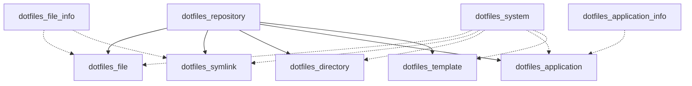

# Terraform Dotfiles Provider Implementation Plan

## Executive Summary

This document provides a detailed implementation roadmap for transforming the current scaffolding into a fully functional Terraform Dotfiles Provider. The implementation follows a phased approach, delivering MVP functionality first, then building toward the comprehensive solution outlined in the design document.

## Current State Assessment

### What We Have
- ✅ Terraform Plugin Framework scaffolding (v1.15.1)
- ✅ Basic provider structure with example resources
- ✅ CI/CD pipeline setup  
- ✅ Testing framework foundation
- ✅ Documentation structure

### What Needs To Be Built
- 🔄 Complete transformation from scaffolding to dotfiles provider
- 🔄 6 core resources and 3 data sources
- 🔄 Platform abstraction layer for cross-platform support
- 🔄 Template engine with Go template support
- 🔄 Backup and conflict resolution system
- 🔄 Security features and validation

## Phase 1: Foundation (MVP) - Weeks 1-4

> **Goal**: Deliver core dotfiles management functionality that can replace basic shell script approaches.

### Week 1: Project Foundation & Provider Setup

#### 1.1 Project Transformation
```bash
# Tasks
- [ ] Update go.mod module path to jamesainslie/dotfiles
- [ ] Update provider metadata (name, version, registry info)
- [ ] Configure provider address in main.go
- [ ] Update terraform-registry-manifest.json
- [ ] Remove all example scaffolding code
- [ ] Set up project structure for dotfiles provider
```

**Deliverables:**
- Clean provider foundation
- Updated project metadata
- Removed scaffolding code

#### 1.2 Core Provider Configuration
```go
// Provider schema implementation
provider "dotfiles" {
  dotfiles_root    = "~/dotfiles"
  backup_enabled   = true
  backup_directory = "~/.dotfiles-backups"
  strategy         = "symlink"
  target_platform  = "auto"
}
```

**Files to create/modify:**
- `internal/provider/provider.go` - Complete provider schema
- `internal/provider/config.go` - Provider configuration model
- `internal/provider/client.go` - Provider client/context

### Week 2: Platform Abstraction & Core Infrastructure

#### 2.1 Platform Abstraction Layer
```go
// Core interfaces to implement
type PlatformProvider interface {
    GetHomeDir() string
    GetConfigDir() string
    ResolvePath(path string) (string, error)
    CreateSymlink(source, target string) error
    CopyFile(source, target string) error
    SetPermissions(path string, mode os.FileMode) error
}
```

**Files to create:**
- `internal/platform/platform.go` - Platform interface definitions
- `internal/platform/darwin.go` - macOS implementation
- `internal/platform/linux.go` - Linux implementation
- `internal/platform/detector.go` - Platform detection logic
- `internal/platform/path_resolver.go` - Cross-platform path resolution

#### 2.2 File Operations Library
**Files to create:**
- `internal/fileops/operations.go` - Core file operations
- `internal/fileops/backup.go` - Backup functionality
- `internal/fileops/validation.go` - File validation utilities
- `internal/fileops/permissions.go` - Permission management

### Week 3: Core Resources Implementation

#### 3.1 dotfiles_repository Resource
```hcl
resource "dotfiles_repository" "main" {
  name        = "personal-dotfiles"
  source_path = "~/dotfiles"
  description = "Personal development environment dotfiles"
  
  default_backup_enabled = true
  default_file_mode      = "0644"
  default_dir_mode       = "0755"
}
```

**Files to create:**
- `internal/provider/repository_resource.go`
- `internal/provider/repository_resource_test.go`
- `internal/models/repository.go` - Repository data model

#### 3.2 dotfiles_file Resource  
```hcl
resource "dotfiles_file" "gitconfig" {
  repository  = dotfiles_repository.main.id
  source_path = "git/gitconfig"
  target_path = "~/.gitconfig"
  file_mode   = "0644"
}
```

**Files to create:**
- `internal/provider/file_resource.go`
- `internal/provider/file_resource_test.go` 
- `internal/models/file.go` - File data model

### Week 4: Symlinks & Basic Templates

#### 4.1 dotfiles_symlink Resource
```hcl
resource "dotfiles_symlink" "fish_config" {
  repository   = dotfiles_repository.main.id
  source_path  = "fish"
  target_path  = "~/.config/fish"
  force_update = false
  create_parents = true
}
```

**Files to create:**
- `internal/provider/symlink_resource.go`
- `internal/provider/symlink_resource_test.go`
- `internal/models/symlink.go` - Symlink data model

#### 4.2 Basic Template Engine
```go
// Template processing interface
type TemplateEngine interface {
    ProcessTemplate(templateContent string, context map[string]interface{}) (string, error)
    ValidateTemplate(templateContent string) error
}
```

**Files to create:**
- `internal/template/engine.go` - Template engine interface
- `internal/template/go_template.go` - Go template implementation
- `internal/template/context.go` - Template context management

#### 4.3 Integration Testing
- Set up acceptance testing framework
- Create basic integration tests for each resource
- Test cross-platform functionality

**Phase 1 Success Criteria:**
- [ ] All 3 core resources implemented and tested
- [ ] Basic templating functional
- [ ] macOS and Linux support working
- [ ] Backup system operational  
- [ ] Integration with real dotfiles repository tested

## Phase 2: Advanced Features - Weeks 5-8

> **Goal**: Add sophisticated dotfiles management capabilities and directory handling.

### Week 5: Directory Management & Enhanced Templates

#### 5.1 dotfiles_directory Resource
```hcl
resource "dotfiles_directory" "fish_config" {
  repository = dotfiles_repository.main.id
  source_path = "fish"
  target_path = "~/.config/fish" 
  
  recursive = true
  include_patterns = ["*.fish", "functions/**"]
  exclude_patterns = ["*.backup"]
  preserve_permissions = true
}
```

#### 5.2 Enhanced Template Processing
- Add template context from system information
- Implement template functions (custom helpers)
- Add template validation and error handling

### Week 6: System Information & Data Sources

#### 6.1 dotfiles_system Data Source
```hcl
data "dotfiles_system" "current" {
  gather_user_info     = true
  gather_platform_info = true
  gather_shell_info    = true
  gather_app_paths     = true
}
```

#### 6.2 dotfiles_file_info Data Source
```hcl
data "dotfiles_file_info" "existing_config" {
  path = "~/.gitconfig"
  check_existence   = true
  check_permissions = true
  check_symlink     = true
  compute_hash      = true
}
```

### Week 7: Conflict Resolution & Backup System

#### 7.1 Advanced Backup System
- Implement backup strategies (timestamp, incremental)
- Add backup restoration capabilities
- Create backup cleanup policies

#### 7.2 Conflict Resolution
- Implement conflict detection algorithms
- Add resolution strategies (backup, merge, skip)
- Create interactive conflict resolution (when possible)

### Week 8: Application Management

#### 8.1 dotfiles_application Resource
```hcl
resource "dotfiles_application" "cursor" {
  repository = dotfiles_repository.main.id
  application = "cursor"
  source_path = "tools/cursor"
  
  detect_installation = true
  only_if_installed = true
  
  config_mappings = {
    "settings.json" = {
      target_path = "{{.app_support_dir}}/Cursor/User/settings.json"
      merge_strategy = "deep_merge"
    }
  }
}
```

**Phase 2 Success Criteria:**
- [ ] Directory resource working with pattern matching
- [ ] Data sources providing accurate system information
- [ ] Conflict resolution functional
- [ ] Application-specific configuration management
- [ ] Enhanced template engine with custom functions

## Phase 3: Security & Enterprise Features - Weeks 9-12

> **Goal**: Add security features, Windows support, and enterprise-ready capabilities.

### Week 9: Security Foundation

#### 9.1 Sensitive Data Handling
```hcl
resource "dotfiles_file" "ssh_key" {
  repository = dotfiles_repository.main.id
  source_path = "ssh/id_ed25519"
  target_path = "~/.ssh/id_ed25519"
  
  sensitive = true
  security = {
    encrypt_at_rest = true
    strict_permissions = true
    required_file_mode = "0600"
    audit_access = true
  }
}
```

#### 9.2 Security Validation
- Implement file content scanning for secrets
- Add permission validation
- Create security policy enforcement

### Week 10: Windows Platform Support

#### 10.1 Windows Implementation
- Implement Windows platform provider
- Add Windows-specific path resolution
- Handle Windows permissions model
- Test Windows symlink capabilities

#### 10.2 Cross-Platform Testing
- Set up Windows testing environment
- Create cross-platform test suites
- Validate path handling across all platforms

### Week 11: Advanced Template Features

#### 11.1 dotfiles_template Resource
```hcl
resource "dotfiles_template" "fish_config" {
  repository = dotfiles_repository.main.id
  source_path = "fish/config.fish.template"
  target_path = "~/.config/fish/config.fish"
  
  engine = "go"
  template_context = {
    features = {
      docker_support = var.enable_docker
      k8s_tools = var.enable_k8s
    }
    platform_config = data.dotfiles_system.current.platform_config
  }
  
  custom_functions = {
    "homebrewBin" = "{{.homebrew_path}}/bin"
  }
  
  post_process_commands = [
    "fish -n {{.target_path}}"
  ]
}
```

### Week 12: Drift Detection & State Management

#### 12.1 Drift Detection
- Implement content hash comparison
- Add automatic drift detection
- Create drift resolution strategies

#### 12.2 Advanced State Management
- Implement provider state tracking
- Add state reconciliation
- Create state export/import capabilities

**Phase 3 Success Criteria:**
- [ ] Security features operational
- [ ] Windows support functional
- [ ] Advanced template resource working
- [ ] Drift detection and remediation
- [ ] Comprehensive cross-platform testing

## Phase 4: Ecosystem Integration - Weeks 13-16

> **Goal**: Polish, optimize, and prepare for production release.

### Week 13: Performance Optimization

#### 13.1 Parallel Operations
- Implement concurrent file operations
- Add operation batching
- Optimize for large dotfiles repositories

#### 13.2 Caching System
- Implement system information caching
- Add file hash caching
- Create cache invalidation strategies

### Week 14: Documentation & Examples

#### 14.1 Comprehensive Documentation
- Create detailed resource documentation
- Add platform-specific guides
- Write migration guides from existing solutions

#### 14.2 Integration Examples
- Complete development environment example
- Team dotfiles management example
- CI/CD integration examples

### Week 15: Testing & Quality Assurance

#### 15.1 Comprehensive Test Suite
- Unit tests for all components
- Integration tests across platforms
- Performance benchmarking
- Security testing

#### 15.2 Quality Improvements
- Code review and refactoring
- Error handling improvements
- Logging and debugging enhancements

### Week 16: Release Preparation

#### 16.1 Release Engineering
- Version tagging and release automation
- Terraform Registry publishing setup
- Documentation publishing
- Community feedback incorporation

**Phase 4 Success Criteria:**
- [ ] Performance optimized for production use
- [ ] Comprehensive documentation complete
- [ ] Full test coverage achieved
- [ ] Ready for Terraform Registry publication

## Technical Architecture Overview

### Core Components

```
terraform-provider-dotfiles/
├── internal/
│   ├── provider/           # Provider implementation
│   │   ├── provider.go     # Main provider
│   │   ├── *_resource.go   # Resource implementations
│   │   └── *_data_source.go # Data source implementations
│   ├── platform/           # Platform abstraction
│   │   ├── platform.go     # Interface definitions
│   │   ├── darwin.go       # macOS implementation
│   │   ├── linux.go        # Linux implementation
│   │   └── windows.go      # Windows implementation
│   ├── fileops/            # File operations
│   │   ├── operations.go   # Core operations
│   │   ├── backup.go       # Backup system
│   │   └── validation.go   # Validation utilities
│   ├── template/           # Template engine
│   │   ├── engine.go       # Template interface
│   │   ├── go_template.go  # Go template impl
│   │   └── context.go      # Context management
│   ├── models/             # Data models
│   └── security/           # Security features
├── docs/                   # Generated documentation
├── examples/               # Usage examples
└── tests/                  # Test suites
```

### Resource Dependency Graph



## Risk Assessment & Mitigation

### Technical Risks

| Risk | Impact | Probability | Mitigation |
|------|--------|-------------|------------|
| Cross-platform compatibility issues | High | Medium | Comprehensive platform abstraction layer, extensive testing |
| Performance with large repositories | Medium | Low | Parallel processing, caching, incremental operations |
| Complex conflict resolution | Medium | Medium | Well-defined resolution strategies, backup system |
| Windows symlink limitations | Medium | High | Alternative strategies (copy mode), clear documentation |

### Project Risks

| Risk | Impact | Probability | Mitigation |
|------|--------|-------------|------------|
| Scope creep | High | Medium | Strict phase discipline, MVP-first approach |
| Testing complexity | Medium | High | Automated testing setup, CI/CD integration |
| Community adoption | Medium | Low | Clear documentation, examples, migration guides |

## Success Metrics

### Phase 1 Metrics
- [ ] All 3 core resources implemented and tested
- [ ] Basic templating functional
- [ ] Cross-platform support (macOS, Linux)
- [ ] Integration with existing dotfiles repository
- [ ] Performance: <2s for typical operations

### Overall Success Metrics
- [ ] **Functionality**: All designed resources and features implemented
- [ ] **Reliability**: <1% failure rate in testing
- [ ] **Performance**: Sub-second operations for typical use cases
- [ ] **Security**: Zero sensitive data exposure in testing
- [ ] **Adoption**: Ready for production use

## Dependencies & Prerequisites

### Development Environment
- Go 1.23+ 
- Terraform 1.0+
- Testing environments: macOS, Linux, Windows
- CI/CD: GitHub Actions

### External Dependencies
- Terraform Plugin Framework v1.15+
- Cross-platform testing infrastructure
- Documentation generation tools

## Next Steps

1. **Immediate Actions**
   - [ ] Set up development environment
   - [ ] Create project structure
   - [ ] Begin Phase 1 implementation

2. **Week 1 Priorities**
   - [ ] Update project metadata and remove scaffolding
   - [ ] Implement provider configuration schema
   - [ ] Set up platform abstraction foundation

3. **Community Engagement**
   - [ ] Share implementation plan for feedback
   - [ ] Set up issue tracking and project management
   - [ ] Establish contribution guidelines

---

*This implementation plan is a living document and will be updated as development progresses and community feedback is incorporated.*
