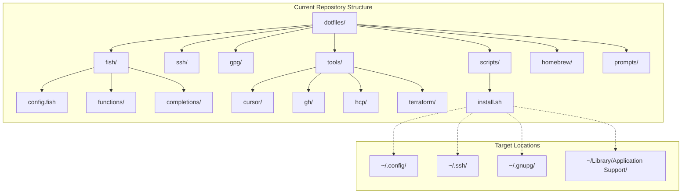
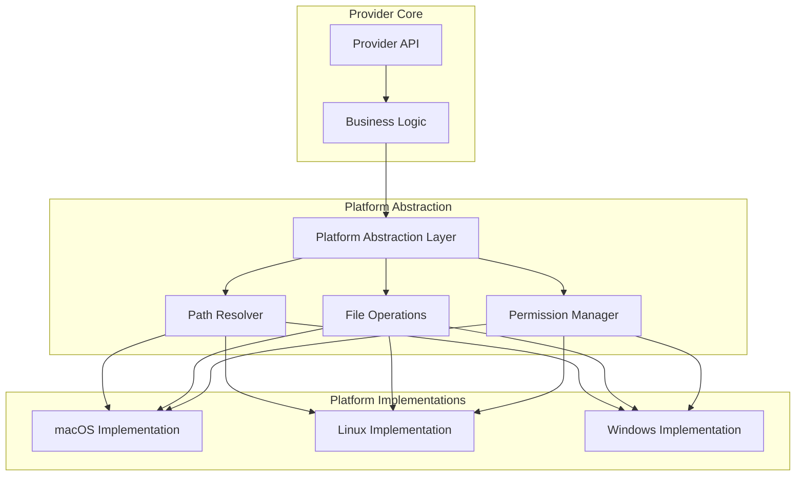
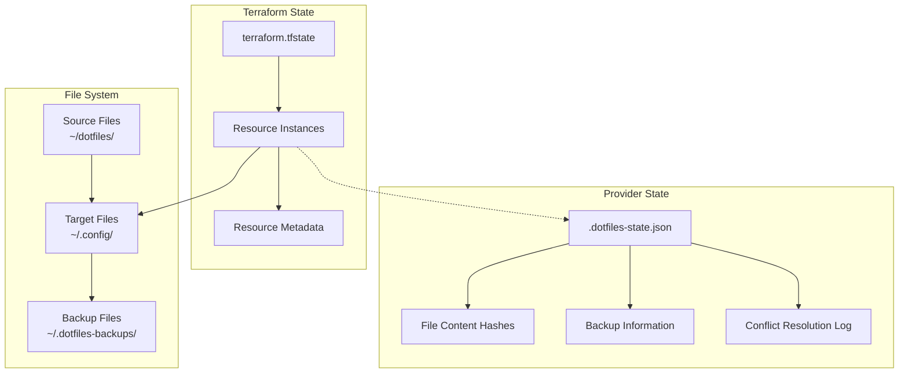
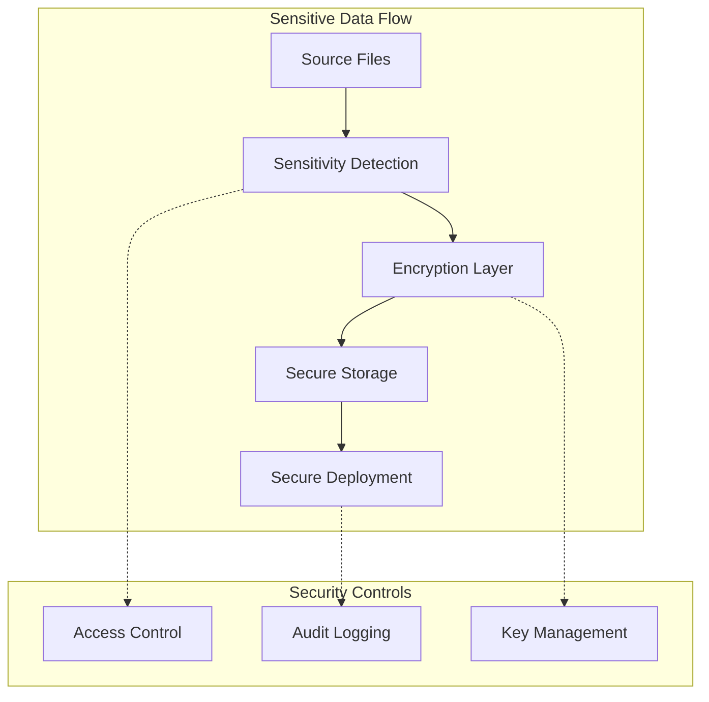
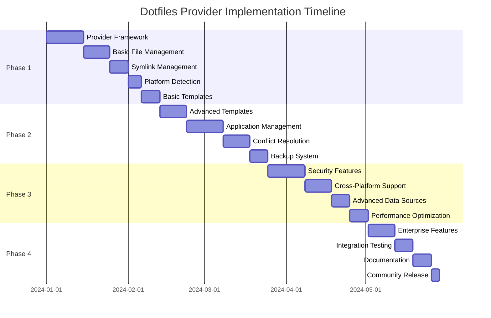

# Terraform Dotfiles Provider Design Document

## Executive Summary

This document outlines the design for a comprehensive Terraform provider (`jamesainslie/dotfiles`) that manages dotfiles in a declarative, cross-platform manner. The provider will complement the existing `jamesainslie/package` provider by handling configuration files, symlinks, templates, and application settings using Infrastructure as Code principles.

## Table of Contents

1. [Vision and Philosophy](#vision-and-philosophy)
2. [Current State Analysis](#current-state-analysis)
3. [Provider Architecture](#provider-architecture)
4. [Resource Specifications](#resource-specifications)
5. [Data Sources](#data-sources)
6. [Cross-Platform Strategy](#cross-platform-strategy)
7. [State Management](#state-management)
8. [Security Considerations](#security-considerations)
9. [Implementation Phases](#implementation-phases)
10. [Integration Examples](#integration-examples)

## Vision and Philosophy

### Core Principles

1. **Declarative Configuration**: Dotfiles as code, version-controlled and reproducible
2. **Cross-Platform Consistency**: Same configuration language across macOS, Linux, Windows
3. **Non-Destructive**: Always backup existing configurations before changes
4. **Idempotent Operations**: Safe to run multiple times without side effects
5. **Template-Driven**: Support dynamic configuration generation
6. **Integration-Friendly**: Work seamlessly with package managers and other providers

### Design Goals

- **🎯 Simplicity**: Easy to adopt for existing dotfiles users
- **🔧 Flexibility**: Support multiple dotfiles management patterns
- **🛡️ Safety**: Never lose user data through backup mechanisms
- **📊 Observability**: Clear state tracking and drift detection
- **🚀 Performance**: Efficient operations even with large dotfiles repositories

## Current State Analysis

### Existing Dotfiles Structure



### Current Management Approach

**Strengths:**
- ✅ Structured organization by application/tool
- ✅ Symlink-based management preserves git history
- ✅ Backup functionality prevents data loss
- ✅ Cross-platform considerations (macOS/Linux paths)

**Limitations:**
- ❌ Bash script approach lacks state tracking
- ❌ No drift detection or automatic remediation  
- ❌ Limited templating capabilities
- ❌ Manual conflict resolution
- ❌ No integration with infrastructure tools

## Provider Architecture

### Provider Configuration

```hcl
terraform {
  required_providers {
    dotfiles = {
      source  = "jamesainslie/dotfiles"
      version = "~> 1.0"
    }
  }
}

provider "dotfiles" {
  # Core configuration
  dotfiles_root    = "~/dotfiles"              # Source repository path
  backup_enabled   = true                      # Enable automatic backups
  backup_directory = "~/.dotfiles-backups"    # Backup storage location
  
  # Behavior settings
  strategy         = "symlink"                 # symlink | copy | template
  conflict_resolution = "backup"              # backup | overwrite | skip | prompt
  dry_run          = false                     # Preview changes without applying
  
  # Platform detection
  auto_detect_platform = true                 # Automatically detect OS/platform
  target_platform      = "auto"              # auto | macos | linux | windows
  
  # Template engine settings
  template_engine = "go"                      # go | handlebars | none
  template_vars = {
    username = "jamesainslie"
    email    = "james@example.com"
  }
  
  # Integration settings
  shell_integration = {
    reload_shell = true                       # Reload shell after changes
    source_files = ["~/.bashrc", "~/.zshrc"] # Files to source after changes
  }
}
```

## Resource Specifications

### 1. dotfiles_repository Resource

Manages the overall dotfiles repository configuration and metadata.

```hcl
resource "dotfiles_repository" "main" {
  name        = "personal-dotfiles"
  source_path = "~/dotfiles"
  
  # Repository metadata
  description = "Personal development environment dotfiles"
  maintainer  = "jamesainslie"
  version     = "2.0.0"
  
  # Global settings
  default_backup_enabled = true
  default_file_mode      = "0644"
  default_dir_mode       = "0755"
  
  # Platform-specific configurations
  platforms = {
    macos = {
      enabled = true
      config_root = "~/.config"
      app_support = "~/Library/Application Support"
    }
    linux = {
      enabled = true  
      config_root = "~/.config"
      app_support = "~/.local/share"
    }
    windows = {
      enabled = false
      config_root = "%APPDATA%"
    }
  }
  
  # Ignore patterns
  ignore_patterns = [
    ".git",
    "*.backup",
    ".DS_Store",
    "README.md"
  ]
  
  lifecycle {
    create_before_destroy = true
  }
}
```

### 2. dotfiles_directory Resource

Manages directory structures and their contents.

```hcl
resource "dotfiles_directory" "fish_config" {
  repository = dotfiles_repository.main.id
  
  name        = "fish-configuration"
  source_path = "fish"
  target_path = "~/.config/fish"
  
  # Directory management
  create_target_parents = true
  preserve_permissions  = true
  recursive            = true
  
  # File filtering
  include_patterns = ["*.fish", "completions/**", "functions/**"]
  exclude_patterns = ["fish_variables", "*.backup"]
  
  # Platform-specific overrides
  platform_overrides = {
    windows = {
      enabled = false  # Skip on Windows
    }
  }
  
  # Conflict resolution
  conflict_strategy = "backup"
  backup_suffix     = ".backup.${formatdate("YYYY-MM-DD-hhmmss", timestamp())}"
}
```

### 3. dotfiles_file Resource

Manages individual files with advanced templating and processing.

```hcl
resource "dotfiles_file" "gitconfig" {
  repository = dotfiles_repository.main.id
  
  name        = "git-configuration"
  source_path = "git/gitconfig.template"
  target_path = "~/.gitconfig"
  
  # File processing
  is_template     = true
  template_engine = "go"
  template_vars = {
    user_name     = var.git_user_name
    user_email    = var.git_user_email
    editor        = var.preferred_editor
    signing_key   = data.dotfiles_gpg_key.main.key_id
  }
  
  # Permissions and ownership
  file_mode = "0644"
  
  # Platform-specific content
  platform_templates = {
    macos = {
      template_vars = {
        credential_helper = "osxkeychain"
        diff_tool        = "opendiff"
      }
    }
    linux = {
      template_vars = {
        credential_helper = "cache"
        diff_tool        = "vimdiff"
      }
    }
  }
  
  # Validation
  validate_command = "git config --file={{.target_path}} --list"
  
  # Dependencies
  depends_on = [dotfiles_directory.git_config]
}
```

### 4. dotfiles_symlink Resource

Manages symbolic links with advanced options.

```hcl
resource "dotfiles_symlink" "ssh_config" {
  repository = dotfiles_repository.main.id
  
  name        = "ssh-configuration"
  source_path = "${dotfiles_repository.main.source_path}/ssh"
  target_path = "~/.ssh"
  
  # Symlink behavior
  force_update    = false  # Don't overwrite existing non-symlinks
  create_parents  = true   # Create parent directories
  relative_links  = false  # Use absolute paths
  
  # Safety checks
  backup_existing = true
  verify_source   = true   # Ensure source exists
  
  # Platform-specific behavior
  platform_config = {
    macos = {
      set_permissions = {
        directory = "0700"
        files     = "0600"
      }
    }
  }
  
  # Post-creation commands
  post_create_commands = [
    "chmod 700 ~/.ssh",
    "chmod 600 ~/.ssh/*"
  ]
}
```

### 5. dotfiles_application Resource

Manages application-specific configurations with complex structures.

```hcl
resource "dotfiles_application" "cursor" {
  repository = dotfiles_repository.main.id
  
  name         = "cursor-editor"
  application  = "cursor"
  source_path  = "tools/cursor"
  
  # Application detection
  detect_installation = true
  detection_methods = [
    {
      type = "command"
      test = "command -v cursor"
    },
    {
      type = "file"
      path = "/Applications/Cursor.app"
    }
  ]
  
  # Configuration mapping
  config_mappings = {
    "cli-config.json" = {
      target_path = "~/.cursor/cli-config.json"
      is_template = true
      required    = false
    }
    
    "user/settings.json" = {
      target_path_template = "{{.app_support_dir}}/Cursor/User/settings.json"
      merge_strategy       = "deep_merge"  # For JSON files
      backup_enabled       = true
    }
    
    "user/keybindings.json" = {
      target_path_template = "{{.app_support_dir}}/Cursor/User/keybindings.json"
      merge_strategy       = "replace"
    }
  }
  
  # Platform-specific paths
  platform_paths = {
    macos = {
      app_support_dir = "~/Library/Application Support"
      config_dir      = "~/.config"
    }
    linux = {
      app_support_dir = "~/.local/share"  
      config_dir      = "~/.config"
    }
  }
  
  # Conditional activation
  only_if_installed = true
  skip_if_missing   = true
}
```

### 6. dotfiles_template Resource

Advanced template processing with multiple engines and contexts.

```hcl
resource "dotfiles_template" "fish_config" {
  repository = dotfiles_repository.main.id
  
  name         = "fish-main-config"
  source_path  = "fish/config.fish.template"
  target_path  = "~/.config/fish/config.fish"
  
  # Template engine configuration
  engine = "go"
  
  # Context variables
  template_context = {
    # Static variables
    shell_name    = "fish"
    config_version = "2.0"
    
    # Dynamic variables from data sources
    homebrew_path = data.dotfiles_system.current.homebrew_prefix
    user_info     = data.dotfiles_system.current.user_info
    
    # Conditional features
    features = {
      tide_prompt     = var.enable_tide_prompt
      docker_support  = var.enable_docker
      kubernetes_tools = var.enable_k8s_tools
    }
    
    # Platform-specific settings
    platform_config = data.dotfiles_system.current.platform_config
  }
  
  # Template functions (custom)
  custom_functions = {
    "homebrewBin" = "{{.homebrew_path}}/bin"
    "configPath"  = "~/.config/{{.}}"
  }
  
  # Validation and formatting
  post_process_commands = [
    "fish -n {{.target_path}}",  # Syntax check
    "fish_indent -w {{.target_path}}"  # Format
  ]
  
  # Change detection
  content_hash_algorithm = "sha256"
  force_update = false
}
```

## Data Sources

### 1. dotfiles_system Data Source

Provides system information for template context and platform-specific logic.

```hcl
data "dotfiles_system" "current" {
  # Information to gather
  gather_user_info     = true
  gather_platform_info = true
  gather_shell_info    = true
  gather_app_paths     = true
  
  # Cache settings
  cache_ttl = "1h"  # Cache system info for performance
}

# Outputs:
# - platform: "macos" | "linux" | "windows"
# - architecture: "amd64" | "arm64" | "386"
# - user_info: { username, home_dir, shell, uid, gid }
# - shell_info: { current_shell, available_shells, shell_version }
# - app_paths: { config_dir, cache_dir, data_dir, app_support_dir }
# - homebrew_prefix: "/opt/homebrew" | "/usr/local" | ""
```

### 2. dotfiles_file_info Data Source

Provides information about existing files for conflict resolution and backup decisions.

```hcl
data "dotfiles_file_info" "existing_gitconfig" {
  path = "~/.gitconfig"
  
  # Information to gather
  check_existence    = true
  check_permissions  = true
  check_symlink      = true
  compute_hash       = true
  read_metadata      = true
}

# Outputs:
# - exists: true | false
# - is_symlink: true | false  
# - symlink_target: "/path/to/target" | ""
# - permissions: "0644"
# - size: 1234
# - modified_time: "2024-01-15T10:30:00Z"
# - content_hash: "sha256:abc123..."
# - is_managed: true | false (by this provider)
```

### 3. dotfiles_application_info Data Source

Detects installed applications and their configuration paths.

```hcl
data "dotfiles_application_info" "cursor" {
  application_name = "cursor"
  
  # Detection methods
  detection_methods = [
    "command_exists",
    "application_bundle",  # macOS
    "desktop_file",       # Linux
    "registry_key"        # Windows
  ]
  
  # Path discovery
  discover_config_paths = true
  discover_data_paths   = true
}

# Outputs:
# - installed: true | false
# - version: "0.17.0" | ""
# - installation_path: "/Applications/Cursor.app"
# - config_paths: ["/Users/user/.cursor", "~/Library/Application Support/Cursor"]
# - executable_path: "/usr/local/bin/cursor"
```

## Cross-Platform Strategy

### Platform Abstraction Layer



### Platform-Specific Configuration

```hcl
# Platform-aware resource definition
resource "dotfiles_file" "shell_profile" {
  name        = "shell-profile"
  source_path = "shell/profile.template"
  
  # Platform-specific target paths
  target_path_by_platform = {
    macos = {
      bash = "~/.bash_profile"
      zsh  = "~/.zprofile"
    }
    linux = {
      bash = "~/.bashrc"
      zsh  = "~/.zshrc"  
    }
    windows = {
      powershell = "~/Documents/PowerShell/profile.ps1"
    }
  }
  
  # Platform-specific template variables
  platform_template_vars = {
    macos = {
      package_manager = "brew"
      config_root    = "~/.config"
      path_separator = ":"
    }
    linux = {
      package_manager = var.linux_package_manager
      config_root    = "~/.config"
      path_separator = ":"
    }
    windows = {
      package_manager = "chocolatey"
      config_root    = "%APPDATA%"
      path_separator = ";"
    }
  }
}
```

## State Management

### State Tracking Strategy



### Drift Detection

```hcl
# Enhanced drift detection capabilities
resource "dotfiles_file" "example" {
  name        = "example-config"
  source_path = "config/example.conf"
  target_path = "~/.config/example.conf"
  
  # Drift detection settings
  drift_detection = {
    enabled           = true
    check_content     = true    # Compare file contents
    check_permissions = true    # Compare file permissions  
    check_symlink     = true    # Verify symlink integrity
    check_frequency   = "on_apply"  # on_apply | daily | weekly
  }
  
  # Drift resolution strategy
  drift_resolution = {
    content_changed     = "warn"      # warn | restore | update_source
    permissions_changed = "fix"       # fix | warn | ignore
    symlink_broken     = "recreate"   # recreate | warn | ignore
    file_deleted       = "restore"    # restore | warn | ignore
  }
  
  # Backup strategy for drift resolution
  backup_on_drift = true
}
```

## Security Considerations

### Sensitive Data Handling



### Security Configuration

```hcl
# Security-aware resource configuration
resource "dotfiles_file" "ssh_private_key" {
  name        = "ssh-private-key"
  source_path = "ssh/id_ed25519"
  target_path = "~/.ssh/id_ed25519"
  
  # Security settings
  sensitive = true
  security = {
    # Encryption settings
    encrypt_at_rest     = true
    encryption_key_source = "system_keychain"  # system_keychain | vault | file
    
    # Access control
    strict_permissions  = true
    required_file_mode  = "0600"
    required_owner      = "current_user"
    
    # Audit and compliance
    audit_access       = true
    compliance_check   = "ssh_key_security"
    
    # Backup security
    encrypt_backups    = true
    secure_delete      = true  # Securely delete old backups
  }
  
  # Validation
  security_validation = {
    check_key_format   = true
    verify_permissions = true
    scan_for_secrets   = false  # Skip since this IS a secret
  }
}

# Security policy resource
resource "dotfiles_security_policy" "default" {
  name = "default-security-policy"
  
  # File classification rules
  sensitive_patterns = [
    "**/*key*",
    "**/*secret*", 
    "**/*password*",
    "**/.*_token",
    "**/.env*"
  ]
  
  # Default security controls
  default_sensitive_permissions = "0600"
  require_encryption_at_rest    = true
  audit_sensitive_access       = true
  
  # Compliance requirements  
  compliance_frameworks = ["soc2", "personal_security"]
}
```

## Implementation Phases

### Phase 1: Core Foundation (MVP)



#### Phase 1 Deliverables

**Core Resources:**
- `dotfiles_repository` - Repository management
- `dotfiles_file` - Basic file management  
- `dotfiles_symlink` - Symlink creation
- `dotfiles_directory` - Directory management

**Basic Features:**
- File copying and symlinking
- Simple templating with Go templates
- Basic backup functionality
- macOS and Linux support
- Terraform state integration

**MVP Configuration Example:**
```hcl
# Phase 1 MVP usage
resource "dotfiles_repository" "main" {
  source_path = "~/dotfiles"
}

resource "dotfiles_symlink" "fish_config" {
  repository  = dotfiles_repository.main.id
  source_path = "fish"
  target_path = "~/.config/fish"
}

resource "dotfiles_file" "gitconfig" {
  repository  = dotfiles_repository.main.id
  source_path = "git/gitconfig"
  target_path = "~/.gitconfig"
  is_template = true
  template_vars = {
    user_name  = "jamesainslie"
    user_email = "james@example.com"
  }
}
```

### Phase 2: Advanced Features

**Enhanced Resources:**
- `dotfiles_application` - Application-specific management
- `dotfiles_template` - Advanced templating engine
- Enhanced conflict resolution
- Comprehensive backup system

**Advanced Features:**
- JSON/YAML merge strategies
- Application detection and conditional configuration
- Advanced template functions and contexts
- Granular conflict resolution policies

### Phase 3: Enterprise & Security

**Security Resources:**
- `dotfiles_security_policy` - Security policy management
- Enhanced sensitive data handling
- Encryption at rest and in transit
- Audit logging and compliance

**Platform Features:**
- Windows support
- Container environment support
- Cloud integration (for team dotfiles)

### Phase 4: Ecosystem Integration

**Integration Features:**
- HashiCorp Vault integration
- CI/CD pipeline support
- Team/organization dotfiles management
- Plugin architecture for extensions

## Integration Examples

### Complete Development Environment

```hcl
# Comprehensive development environment using both providers
terraform {
  required_providers {
    pkg = {
      source  = "jamesainslie/package"
      version = "~> 0.1.14"
    }
    dotfiles = {
      source  = "jamesainslie/dotfiles"
      version = "~> 1.0"
    }
  }
}

# System package management
resource "pkg_package" "development_tools" {
  for_each = toset([
    "fish",
    "git", 
    "terraform",
    "kubectl",
    "docker"
  ])
  
  name  = each.key
  state = "present"
}

# Dotfiles management
resource "dotfiles_repository" "personal" {
  name        = "personal-dotfiles"
  source_path = "~/dotfiles"
  
  depends_on = [pkg_package.development_tools]
}

# Shell configuration
resource "dotfiles_directory" "fish_config" {
  repository  = dotfiles_repository.personal.id
  source_path = "fish"
  target_path = "~/.config/fish"
  
  depends_on = [pkg_package.development_tools["fish"]]
}

# Application configurations
resource "dotfiles_application" "development_tools" {
  for_each = toset(["cursor", "git", "terraform"])
  
  repository   = dotfiles_repository.personal.id
  application  = each.key
  source_path  = "tools/${each.key}"
  
  only_if_installed = true
}

# Template-driven configurations
resource "dotfiles_template" "fish_config" {
  repository   = dotfiles_repository.personal.id
  source_path  = "fish/config.fish.template"
  target_path  = "~/.config/fish/config.fish"
  
  template_context = {
    homebrew_installed = contains(keys(pkg_package.development_tools), "brew")
    docker_available   = contains(keys(pkg_package.development_tools), "docker")
    k8s_tools_available = contains(keys(pkg_package.development_tools), "kubectl")
  }
  
  depends_on = [
    dotfiles_directory.fish_config,
    pkg_package.development_tools
  ]
}
```

### Team Dotfiles Management

```hcl
# Team/organization dotfiles with role-based configuration
resource "dotfiles_repository" "team" {
  name        = "team-dotfiles"
  source_path = "~/team-dotfiles"
  
  # Team-specific settings
  team_config = {
    organization = "mycompany"
    team_name   = "platform-engineering"
    role_based_configs = true
  }
}

# Role-based application configurations
resource "dotfiles_application" "kubectl_config" {
  repository  = dotfiles_repository.team.id
  application = "kubectl"
  source_path = "kubernetes/kubectl"
  
  # Role-based configuration selection
  config_variant = var.user_role  # "developer" | "sre" | "admin"
  
  template_context = {
    user_role    = var.user_role
    team_name    = "platform-engineering"
    cluster_access = data.kubernetes_user_access.current.clusters
  }
}

# Conditional security configurations
resource "dotfiles_file" "security_tools" {
  count = var.user_role == "sre" ? 1 : 0
  
  repository  = dotfiles_repository.team.id
  source_path = "security/sre-tools.conf.template"
  target_path = "~/.config/security-tools.conf"
  
  sensitive = true
  security = {
    encrypt_at_rest = true
    audit_access   = true
  }
}
```

### CI/CD Integration

```hcl
# Automated dotfiles testing and deployment
resource "dotfiles_repository" "ci_test" {
  source_path = "/workspace/dotfiles"
  
  # CI/CD specific settings
  ci_mode = true
  validation = {
    syntax_check     = true
    template_render  = true
    security_scan    = true
    cross_platform_test = ["macos", "linux"]
  }
}

# Validation-only resources for CI
resource "dotfiles_template" "validate_all" {
  for_each = fileset("${path.module}/templates", "**/*.template")
  
  repository   = dotfiles_repository.ci_test.id
  source_path  = "templates/${each.key}"
  target_path  = "/tmp/validation/${each.key}"
  
  # CI mode - validate but don't deploy
  validation_only = true
  
  template_context = var.test_template_context
}
```

## Provider Configuration Schema

### Complete Provider Configuration

```hcl
provider "dotfiles" {
  # Core settings
  dotfiles_root    = "~/dotfiles"
  backup_enabled   = true
  backup_directory = "~/.dotfiles-backups"
  
  # Behavior configuration
  strategy            = "symlink"        # symlink | copy | template | hybrid
  conflict_resolution = "backup"         # backup | overwrite | skip | prompt | interactive
  dry_run            = false             # Preview mode
  force_mode         = false             # Skip safety checks
  
  # Platform settings
  auto_detect_platform = true
  target_platform     = "auto"          # auto | macos | linux | windows
  cross_platform_mode = false           # Enable cross-platform deployments
  
  # Template engine
  template_engine = "go"                 # go | handlebars | mustache | none
  template_vars = {
    # Global template variables
    user_name = "jamesainslie"
    org_name  = "personal"
  }
  
  # Security settings
  security = {
    enabled                = true
    encrypt_sensitive      = true
    key_source            = "system"     # system | vault | file
    audit_enabled         = true
    compliance_mode       = false
  }
  
  # Performance settings
  performance = {
    parallel_operations = 10
    cache_enabled      = true
    cache_ttl         = "1h"
  }
  
  # Integration settings
  integrations = {
    vault_enabled     = false
    git_integration   = true
    shell_reload      = true
  }
  
  # Logging and debugging
  log_level = "info"                     # debug | info | warn | error
  debug_mode = false
}
```

## Success Metrics

### Phase 1 Success Criteria
- [ ] Basic file and symlink management working
- [ ] Template rendering functional  
- [ ] Backup system operational
- [ ] macOS and Linux support
- [ ] Integration with existing dotfiles repository
- [ ] Terraform state properly maintained

### Long-term Success Metrics
- **Adoption**: 1000+ downloads in first 6 months
- **Reliability**: <1% failure rate in production use
- **Performance**: Sub-second operations for typical dotfiles repos
- **Security**: Zero sensitive data exposure incidents
- **Community**: Active community contributions and extensions

## Conclusion

The Terraform Dotfiles Provider will bridge the gap between traditional dotfiles management and modern Infrastructure as Code practices. By providing declarative, idempotent, and secure dotfiles management, it will enable developers to treat their development environments with the same rigor as production infrastructure.

The phased implementation approach ensures rapid delivery of core value while building toward a comprehensive solution that can scale from individual developers to enterprise teams.

**Next Steps:**
1. Validate design with community feedback
2. Begin Phase 1 implementation
3. Establish testing framework
4. Create documentation and examples
5. Plan community release strategy

---

*This design document is a living document and will be updated as implementation progresses and community feedback is incorporated.*
